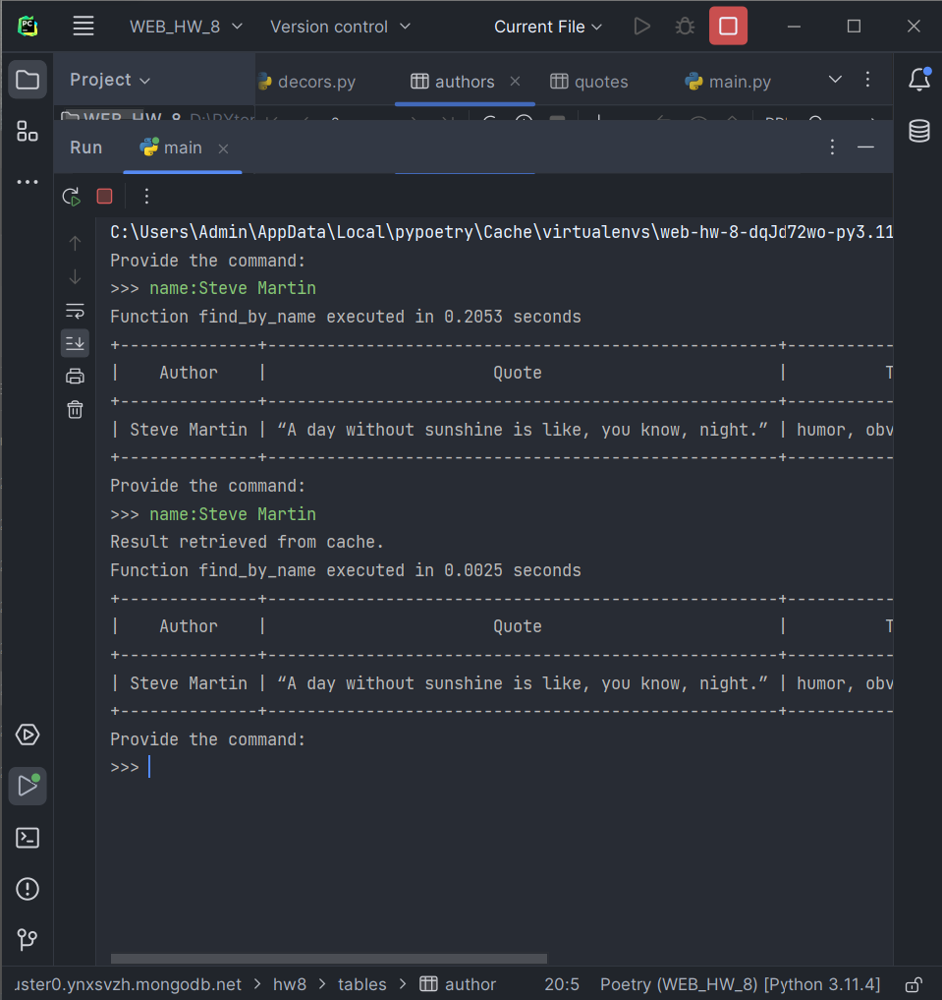

## Опис проекту

Цей проект є програмою для пошуку цитат за допомогою різних параметрів, таких як ім'я автора, тег цитати, список тегів, текст цитати та місце народження автора. Програма використовує базу даних MongoDB для зберігання даних про авторів та їх цитати.

## Як працює програма

1. Програма підключається до бази даних MongoDB за допомогою модуля `mongoengine` і зчитує параметри підключення з конфігураційного файлу `config.ini`.
2. Далі, програма використовує декоратори для кешування результатів функцій, вимірювання часу виконання та обробки порожніх результатів.
3. Програма має набір функцій для пошуку цитат за різними параметрами. Кожна функція виконує запит до бази даних та повертає список знайдених цитат.
4. Результати пошуку виводяться на екран у вигляді таблиці з колонками "Автор", "Цитата" та "Теги".

## Як запустити програму

1. Запусти головний файл `main.py`: `python main.py`
2. Введи команду для пошуку цитати. Приклади команд: 
   - `name:Ім'я Автора` - пошук цитат за іменем автора
   - `tag:Тег` - пошук цитат за тегом або частиною тегу
   - `tags:Тег1,Тег2,Тег3` - пошук цитат за списком тегів (розділені комами, без пробілів)
   - `quote:Текст цитати` - пошук цитат за частиною тексту цитати
   - `born:Місце народження` - пошук цитат за місцем народження автора
   - `exit` - вийти з програми
   
   Примітка: Усі команди вводяться у форматі `назва_команди:параметр`.

## Приклад роботи

   
## Бібліотеки Python: 
`mongoengine`, `pymongo`, `prettytable`
