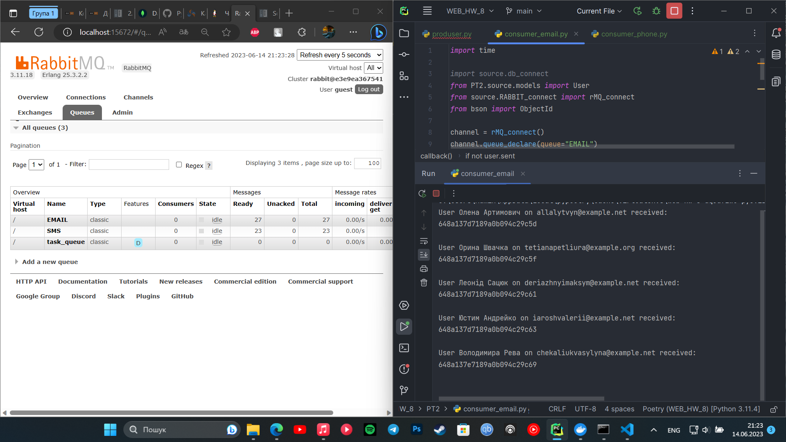

## Опис проекту

Цей навчальний проект для тестування надсилання повідомлень за допомогою RabbitMQ.
Використовуючи модуль mongoengine, проект підключається до бази даних MongoDB для зберігання користувачів та їх контактної інформації. 
Користувачі можуть бути повідомлені за допомогою електронної пошти або SMS.

## Як працює проект


### Відправлення повідомлень

У файлі `producer.py` знаходиться функція `main`, яка відповідає за відправлення повідомлень. Спочатку видаляються всі записи користувачів з бази даних. Потім генерується список користувачів за допомогою функції `seed_users()` з файлу `seeds.py`. Після цього, для кожного користувача виконується перевірка способу зв'язку (електронна пошта або телефон) і відповідне повідомлення надсилається через RabbitMQ.

### Обробка повідомлень

У файлах `comsumer_email.py` та `comsumer_phone.py` містяться функції обробки повідомлень з черг "EMAIL" та "SMS" відповідно. Коли повідомлення отримується з черги, виконується пошук користувача в базі даних за його ідентифікатором. Якщо користувач не був раніше повідомлений, відбувається зміна його статусу та збереження змін до бази даних. Після цього, повідомлення виводиться у консоль.

## Використання проекту

Для користування проектом, який включає підключення до бази даних MongoDB, комунікацію з RabbitMQ та обробку користувачів і надсилання повідомлень, вам потрібно виконати наступні кроки:

1. **Налаштування бази даних MongoDB**: Перед початком використання проекту необхідно налаштувати базу даних MongoDB та створити базу даних.

2.  **Встановалення RabbitMQ через Docker-container**:
    ```shell
    docker run -d --name rabbitmq -p 5672:5672 -p 15672:15672 rabbitmq:3.11-management
    ```
    

3. **Запуск проекту**: Після встановлення залежностей ви можете запустити проект. Головний файл для запуску - `producer.py`. Він створює випадкових користувачів, зберігає їх у базі даних та надсилає повідомлення через RabbitMQ. Запустіть файл `producer.py`, виконавши команду `python producer.py` в командному рядку.

4. **Спостереження за повідомленнями**: Проекти `comsumer_email.py` та `comsumer_phone.py` слугують споживачами повідомлень. Вони слідкують за чергою "EMAIL" та "SMS" відповідно, отримують повідомлення та обробляють їх. Щоб спостерігати за надсиланими повідомленнями, запустіть файли `comsumer_email.py` та `comsumer_phone.py` відповідно.

5. **Завершення роботи**: Після виконання проекту, припиніть спостереження за повідомленнями та закрийте з'єднання. Для цього натисніть `Ctrl+C` в командному рядку, де запущені файли `comsumer_email.py` та `comsumer_phone.py`, а також закрийте з'єднання до RabbitMQ та MongoDB.


## Приклад роботи



### Використані модулі

Проект використовує декілька модулів для забезпечення своєї функціональності. Основні модулі, які були задіяні в проекті, описані нижче:

- `mongoengine`
- `configparser`
- `pathlib`
- `pika`
- `faker`

